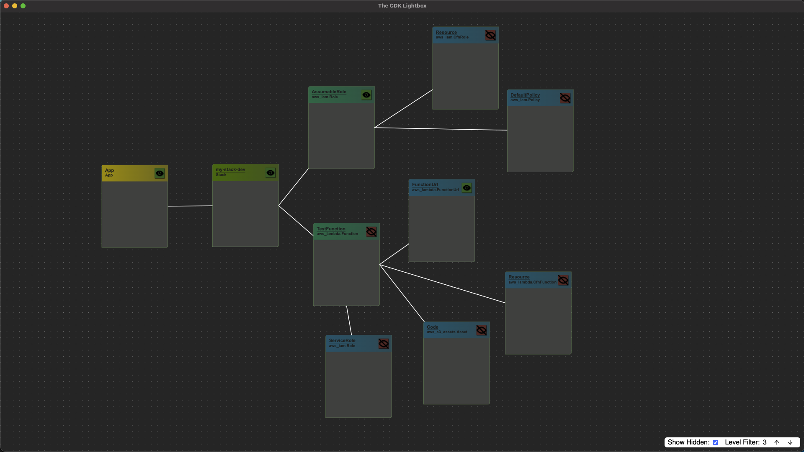

# The CDK Lightbox

The CDK Lightbox is a tool for visualizing your CDK applications.

## Installing

Head over to [Releases](https://github.com/the-ocf/cdklightbox/releases) and download the package for your operating system.

## Using

Please watch [this video](https://www.youtube.com/watch?v=OK9c-PuoYSM&ab_channel=MatthewBonig) to get an introduction to the CDK Workbench.

If you have further questions, ask them at the cdk.dev's [Slack server](https://cdk.dev) in the #cdklightbox channel.

## Donations

**Donations will ensure the following:**

- 🔨 Long term maintenance of the project, including covering build costs and paying for MacOS Developer Licenses.

## Contributing

This project is built with ElectronJS and the Electron React Boilerplate and is completely open source, built by the CDK community, for the CDK community.
Please refer to [the Contributing doc](./CONTRIBUTING.md) for how to develop and [submit Pull Request](https://github.com/the-ocf/cdklightbox/issues).
